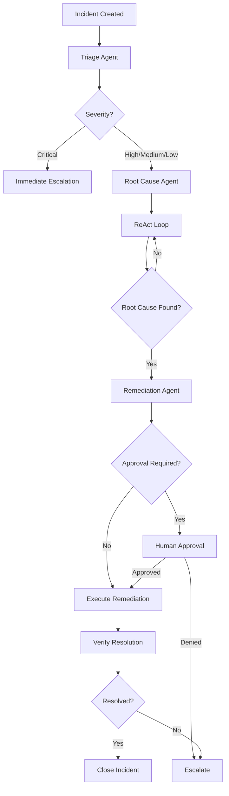

# Multi-Agent IT Operations System

A production-ready, AI-powered incident management system using AWS services and multi-agent orchestration.

## 🏗️ Architecture

This system implements a sophisticated multi-agent architecture for automated IT incident detection, analysis, and resolution:
```
┌─────────────────────────────────────────────────────────────┐
│                        Web UI (S3)                          │
│                 User Interface & Visualization               │
└────────────────────┬────────────────────────────────────────┘
                     │
                     ↓
┌─────────────────────────────────────────────────────────────┐
│                    API Gateway (REST)                        │
│              Incident Creation & Management API              │
└────────────────────┬────────────────────────────────────────┘
                     │
                     ↓
┌─────────────────────────────────────────────────────────────┐
│            Step Functions (Orchestrator)                     │
│    Multi-Agent Coordination with ReAct Pattern              │
└──┬────────────────┬────────────────┬────────────────────────┘
   │                │                │
   ↓                ↓                ↓
┌────────┐    ┌──────────┐    ┌──────────────┐
│ Triage │    │ Root     │    │ Remediation  │
│ Agent  │───→│ Cause    │───→│ Agent        │
│        │    │ Agent    │    │              │
└────────┘    └──────────┘    └──────────────┘
   │                │                │
   │                ↓                │
   │         ┌──────────────┐        │
   └────────→│ MCP Servers  │←───────┘
             │ (Tools)      │
             └──────────────┘
                     │
                     ↓
┌─────────────────────────────────────────────────────────────┐
│                  Data Layer (DynamoDB)                       │
│  Incidents | Agent State | Knowledge Base | Approvals       │
└─────────────────────────────────────────────────────────────┘
```

## 🎯 Key Features

### Multi-Agent System
- **Triage Agent**: Assesses incident severity and determines routing
- **Root Cause Agent**: Uses ReAct pattern (Reason-Act-Observe) for investigation
- **Remediation Agent**: Proposes and executes safe remediation steps

### MCP (Model Context Protocol) Integration
- **Monitoring MCP**: CloudWatch metrics, logs, and X-Ray traces
- **Incident MCP**: CRUD operations and AI-powered analysis
- Circuit breakers for resilience
- Standardized tool definitions

### Production-Ready Features
- ✅ Human-in-the-loop approval workflows
- ✅ Circuit breakers and timeout mechanisms
- ✅ Comprehensive error handling and retry logic
- ✅ CloudWatch monitoring and alarms
- ✅ Audit trails and incident timelines
- ✅ State management with DynamoDB
- ✅ Web UI for visualization
- ✅ REST API for programmatic access

## 📋 Prerequisites

- AWS CLI configured with appropriate credentials
- Python 3.12+
- Bash shell (for deployment scripts)
- AWS Account with permissions for:
  - Lambda, Step Functions, DynamoDB
  - API Gateway, S3, CloudWatch
  - IAM role creation

## 🚀 Quick Start

### 1. Clone and Setup
```bash
# Clone the repository
git clone <repository-url>
cd itops-multiagent-system

# Verify structure
ls -la
```

### 2. Deploy Everything
```bash
# Deploy entire system (takes ~5-10 minutes)
./deploy.sh
```

The script will:
- Create DynamoDB tables
- Deploy IAM roles
- Deploy 12 Lambda functions
- Create Step Functions state machine
- Setup API Gateway
- Deploy Web UI to S3
- Create CloudWatch dashboards and alarms
- Populate knowledge base
- Generate test data

### 3. Access the System

After deployment completes, you'll see:
```
Web UI:   http://itops-multiagent-ui-XXXXX.s3-website-us-east-1.amazonaws.com
API:      https://XXXXX.execute-api.us-east-1.amazonaws.com/prod
```

## 📖 Usage Guide

### Creating an Incident

**Via Web UI:**
1. Open the Web UI URL
2. Fill in the incident form
3. Click "Create Incident"
4. Click on the incident to view details
5. Click "🤖 Start AI Resolution"

**Via API:**
```bash
curl -X POST https://YOUR-API-ENDPOINT/prod/incidents \
  -H "Content-Type: application/json" \
  -d '{
    "title": "Lambda function timeout",
    "description": "Function timing out after 30 seconds",
    "severity": "high",
    "affected_services": ["Lambda", "API-Gateway"],
    "detected_by": "monitoring-system"
  }'
```

### Monitoring the System

**CloudWatch Dashboard:**
- View real-time metrics
- Monitor agent performance
- Track error rates

**Step Functions Console:**
- Watch execution flow
- See agent reasoning steps
- Debug failures

**Lambda Logs:**
```bash
# View agent logs
aws logs tail /aws/lambda/ITOps-Agent-Triage --follow

# View all agent logs
aws logs tail /aws/lambda/ITOps-Agent-* --follow
```

### Testing

Run the integration test suite:
```bash
cd tests
python integration_tests.py
```

Generate test incidents:
```bash
aws lambda invoke \
  --function-name ITOps-TestDataGenerator \
  --payload '{"action": "generate_multiple", "count": 5}' \
  output.json
```

## 🏗️ Architecture Details

### Agent Workflow


### Data Flow

1. **Incident Creation** → DynamoDB (Incidents table)
2. **Triage** → Assessment stored in Agent State
3. **Root Cause Analysis** → Iterative investigation with MCP tools
4. **Remediation** → Approval queue → Execution → Verification
5. **Resolution** → Timeline updated → Notification sent

## 🔧 Configuration

### Environment Variables

Update in Lambda functions as needed:
```bash
# In Lambda console or via CLI
aws lambda update-function-configuration \
  --function-name ITOps-Agent-Triage \
  --environment Variables="{KEY=value}"
```

### Timeouts and Memory

Adjust in `deploy.sh`:
```bash
deploy_lambda_function "FunctionName" "source-dir" "handler" TIMEOUT MEMORY
```

### Circuit Breaker Thresholds

Edit in `lambda-functions/mcp-*/lambda_function.py`:
```python
CircuitBreaker('service_name', failure_threshold=5, timeout=60)
```

## 📊 Monitoring and Alerting

### CloudWatch Alarms

Pre-configured alarms:
- High error rates (>5 errors in 5 minutes)
- High latency (>30 seconds average)
- Step Functions failures
- DynamoDB throttling

### Metrics to Watch

- **Agent Invocations**: Normal workload patterns
- **Agent Errors**: Should be near zero
- **Agent Duration**: p99 should be <45 seconds
- **Step Functions Success Rate**: Should be >95%

## 🧪 Testing

### Unit Tests (per Lambda)
```bash
cd lambda-functions/agent-triage
python -m pytest test_lambda_function.py
```

### Integration Tests
```bash
python tests/integration_tests.py
```

### Load Testing
```bash
# Generate 100 incidents
for i in {1..100}; do
  aws lambda invoke \
    --function-name ITOps-TestDataGenerator \
    --payload '{"action": "generate_incident"}' \
    /dev/null &
done
wait
```

## 🔒 Security

### IAM Roles

Least privilege access:
- Lambda execution role: DynamoDB, CloudWatch, Bedrock
- Step Functions role: Lambda invocation, SNS publish
- API Gateway role: Lambda invocation only

### Data Protection

- DynamoDB encryption at rest (AWS managed keys)
- VPC endpoints (optional, not included)
- API Gateway throttling
- Input validation in all functions

### Secrets Management

For production, use AWS Secrets Manager:
```python
import boto3
secrets = boto3.client('secretsmanager')
secret = secrets.get_secret_value(SecretId='mySecret')
```

## 💰 Cost Optimization

### Estimated Monthly Costs

For 1000 incidents/month:

- Lambda: ~$10-20
- Step Functions: ~$5-10
- DynamoDB: ~$5 (pay per request)
- API Gateway: ~$3-5
- S3: ~$1
- CloudWatch: ~$5
- **Total: ~$30-50/month**

### Cost Reduction Tips

1. Use Lambda provisioned concurrency selectively
2. Enable DynamoDB auto-scaling (not needed at low volume)
3. Set CloudWatch Logs retention to 7 days
4. Use S3 lifecycle policies for old data

## 🐛 Troubleshooting

### Common Issues

**1. Lambda Timeout**
```
Error: Task timed out after 60 seconds
```
**Solution**: Increase timeout in deploy.sh or Lambda console

**2. Circuit Breaker Open**
```
Error: Circuit breaker OPEN for service
```
**Solution**: Wait 60 seconds or check underlying service health

**3. DynamoDB Throttling**
```
Error: ProvisionedThroughputExceededException
```
**Solution**: Switch to on-demand billing or increase capacity

**4. Bedrock Access Denied**
```
Error: Could not invoke Bedrock model
```
**Solution**: Enable model access in Bedrock console

### Debug Commands
```bash
# View Lambda logs
aws logs tail /aws/lambda/FUNCTION_NAME --follow

# Describe Step Functions execution
aws stepfunctions describe-execution \
  --execution-arn EXECUTION_ARN

# Check DynamoDB item
aws dynamodb get-item \
  --table-name ITOps-Incidents \
  --key '{"incident_id": {"S": "INC-12345678"}}'
```

## 🧹 Cleanup

Remove all resources:
```bash
./cleanup.sh
```

**Warning**: This deletes all data permanently!

## 📚 Additional Resources

- [AWS Step Functions Best Practices](https://docs.aws.amazon.com/step-functions/latest/dg/best-practices.html)
- [Amazon Bedrock Documentation](https://docs.aws.amazon.com/bedrock/)
- [MCP Protocol Specification](https://spec.modelcontextprotocol.io/)
- [ReAct Pattern Paper](https://arxiv.org/abs/2210.03629)

## 🤝 Contributing

This is a reference implementation for learning. To adapt:

1. Fork the repository
2. Modify agent prompts in Lambda functions
3. Add new MCP tools as needed
4. Update Step Functions for your workflow
5. Test thoroughly before production use

## 📝 License

MIT License - feel free to use and modify for your needs.

## 🙋 Support

For issues or questions:
1. Check `deployment-info.txt` after deployment
2. Review CloudWatch logs
3. Check AWS service quotas
4. Review this README thoroughly

## 🎓 Learning Path

1. **Start Here**: Deploy and explore the Web UI
2. **Understand Agents**: Review agent Lambda function code
3. **Study MCP**: Examine MCP server implementations
4. **Deep Dive**: Step Functions state machine definition
5. **Extend**: Add your own agents and tools

---

**Built with ❤️ using AWS, Claude, and the MCP protocol**
